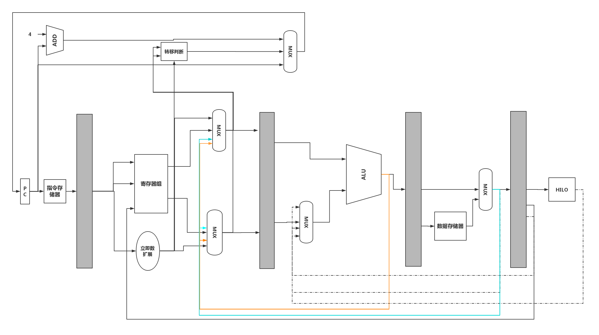

# 基于MIPS32指令集的多周期流水CPU

+ 日期：2019年12月
+ 系统硬件综合设计项目
+ 完全参考《自己动手写CPU》

## 题目要求

设计并实现一个多周期流水CPU进一步理解和掌握CPU设计的基本原理和过程。

①　若干段流水、可以处理冲突

②　三种类型的指令若干条

③　MIPS、ARM、RISC-V等类型CPU都可以

④　下载到FPGA上进行验证（选）

## 最终实现的功能

（1）**使用哈佛架构**

​			指令存储器和数据存储器分离。

（2）**五级流水线**

​			包括 取指(IF）、译码（ID）、执行（EX）、访存（MEM）、回写（WB）。

​			取指：由PC给出指令地址，从指令存储器中取出指令，传递给IF_ID流水线寄存器

​			译码：对指令译码，生成相关控制信号和数据信号传递到下一级流水线。在ID段判断转移指令是否跳转，若							跳转则计算出转移地址给pc。				   

​		   执行：根据上一级流水线传递的信息进行计算。

​		   访存：主要针对数据存储器进行操作

​          回写：将数据写入到寄存器或HI、LO寄存器

（3）**实现了40条指令**

​          空指令  [1条]

​              NOP

​          逻辑指令 [8条]

​               AND、OR、XOR、NOR、ANDI、ORI、XORI、LUI

​          访存指令 [2条]

​                LW、SW

​          算术指令 [12条]

​                ADDU、SUBU、SLT、SLTU、ADDIU、SLTI、SLTIU、CLZ、CLO、MUL、MULT、MULTU

​          转移指令 [8条]

​               JR、J、BEQ、BGTZ、BLEZ、BNE、BLTZ、BGEZ

​          移位指令 [6条]

​                SLL、SRL、SRA、SLLV、SRLV、SRAV

​          移动指令 [6条]

​                 MOVN、MOVZ、MFHI、MFLO、MTHI、MTLO

（4）**数据通路**

​		